## Задача 1. Инструмент ipcalc.

- Поднимаю виртуальную машину на Ubuntu 20.04 Server LTS.

### 1.1. Сети и маски.

- Определяем адрес сети ``192.167.38.54/13``: устанавливаем утилиту ipcalc. После чего в терминале указываем ``ipcalc 192.167.38.54/13``. Получаем адрес сети (Network) ``192.160.0.0/13``

  

- Определяем перевод маски ``255.255.255.0`` в префиксную запись - ищем поле ``Netmask``, указана префиксная запись. ``= 26``.
- Определяем перевод маски ``255.255.255.0`` в двоичную запись - ищем поле ``Netmask``, в самой правой колонке указана двоичная запись. ``11111111.11111111.11111111.00000000``

  
  
- Определяем перевод маски ``/15`` в обычную запись - ищем поле ``Netmask``, первая колонка до ``/15`` указывает на обычную запись маски. ``255.254.0.0``.

- Определяем перевод маски ``/15`` в двоичную запись - ищем поле ``Netmask``, последняя колонка указывает на двричную запись маски ``/15``. ``11111111.11111110.00000000.00000000``

  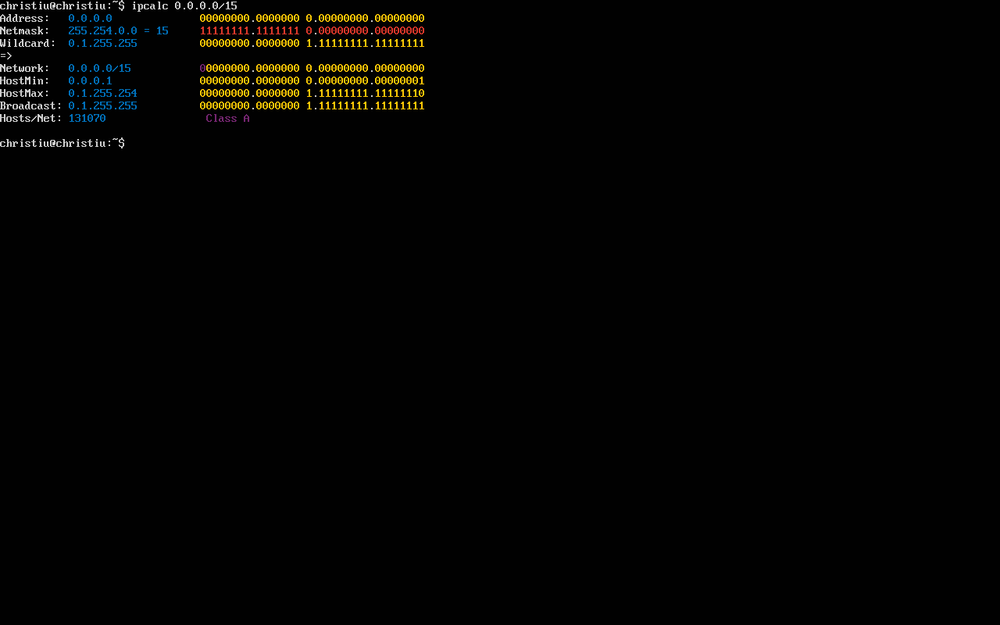

- Определяем перевод двоичного кода ``11111111.11111111.11111111.11110000`` в префиксную запись. Количество единиц в двоичном коде составляет префиксную маску. ``/28``

- Определяем перевод двоичного кода ``11111111.11111111.11111111.11110000`` в обычную запись по формуле ``(1*2^7+1*2^6+1*2^5+1*2^4+0 = 240)``. получим запись ``255.255.255.240`` 

- Определяем минимальный и максимальный хост в сети 12.167.38.4 с маской ``/8``. Используем ``ipcalc  12.167.38.4/8``. ``HostMin: 12.0.0.1 HostMax: 12.255.255.254``

  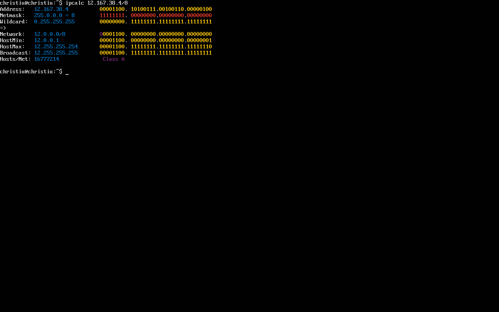

- Определяем минимальный и максимальный хост в сети ``12.167.38.4`` с маской ``1111111.11111111.00000000.00000000``. Для этого переводим из двоичной в префиксную запись и получаем ``/16``. Используем ``ipcalc  12.167.38.4/16``

    

- Определяем минимальный и максимальный хост в сети 12.167.38.4 с маской ``255.255.254.0``. Используем ``ipcalc  12.167.38.4 255.255.254.0``. По формуле считаем сумму из числел и их позиций ``(2 в степени 7-0 означает, что нам на каждой позиции заложено определнное кол-во мест)``, которая дает 254. Это ``11111111.11111111.11111110.00000000``, в переводе в префикс это ``/13``. По аеналогии с предыдущими заданиями получаем ``HostMin: 12.160.0.1 HostMax: 12.267.255.254``

    

- Определяем минимальный и максимальный хост в сети 12.167.38.4 с маской ``/4``. Используем ``ipcalc  12.167.38.4/8``. ``HostMin: 0.0.0.1 HostMax: 15.255.255.254``

    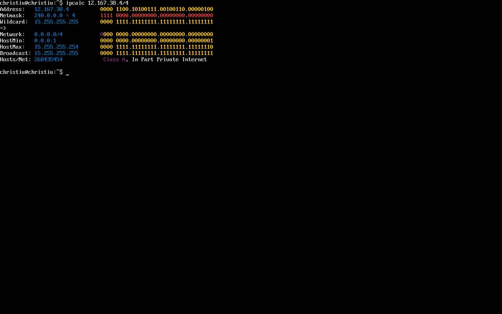

### 1.2. localhost

- Определи и запиши в отчёт, можно ли обратиться к приложению, работающему на localhost, со следующими IP: 194.34.23.100, 127.0.0.2, 127.1.0.1, 128.0.0.1

- Для начала необходимо обратиться к сетевым интерфесам и узнать IP localhost: ``ip addr show lo`` lo - это loopback интерфейс. Получим IP 127.0.0.1/8
- /8 - выделено 8 бит на хост, следовательно наша основная сеть 127.0.0.0. напрямую мы можем обратиться к приложению с IP 127.0.0.2, 127.1.0.1 так как они находятся в одной сети. Отсальные IP потребуют ssh-тунели (128.0.0.1 и 194.34.23.100 невозможно). Шлюз в даном случае использовать мы не можем, так как lo является виртульаным интерфейсом, трафик которого не выходит на сетевую карту (на провод) + Шлюз не видит этот трафик: Шлюз стоит на границе вашей сетевой карты. Поскольку пакеты для localhost до сетевой карты даже не доходят, шлюзу просто нечего «маршрутизировать».

### 1.3. Диапазоны и сегменты сетей

- Для определения какой IP можно использовать в качестве публичного, а какой только в качестве частного используем также ``ipcalc``. Его интерфейс укажет пометкой ``Privat Internet`` на серую сеть и другим обозначением на белую.
1. 10.0.0.45 частная Privat Internet
2. 134.43.0.2 Публичный
3. 192.168.4.2 частная Privat Internet
4. 172.20.250.4 частная Privat Internet
5. 172.0.2.1 Публичный
6. 192.172.0.1 Публичный
7. 172.68.0.2 Публичный
8. 172.16.255.255 частная Privat Internet
9. 10.10.10.10 частная Privat Internet
10. 192.169.168.1 Публичный

- Какие из перечисленных IP-адресов шлюза возможны у сети 10.10.0.0/18:
1. 10.0.0.1, нет
2. 10.10.0.2, да
3. 10.10.10.10, да
4. 10.10.100.1, нет
5. 10.10.1.255 да
- диапазон 10.10.0.1 – 10.10.63.254
- Шлюз должен гаходиться в границах нашей сети, поэтому определяем границы сети 10.10.0.0/18 (маска 255.255.192.0 указывает на 3 октет. 256-192=64 - это говорит, что новая подсеть начнется с 64, значит наша окончится на 63). Следовательно делаем вывод, что последний хост будет 10.10.63.254 (255 широковещательный), а первый 10.10.0.1 (0 запасной). Дополнительно используем ``ipcalc 10.10.0.0/18`` и ищем ``Hostmax & Hostmin`` – указывают на начало и конец диапазона, в котором расположена сеть.

## Задача 2. Статическая маршрутизация между двумя машинами

- Вывод команды ``ip addr show`` для просмотра существующих сетевых интерфейсов для ws1:
    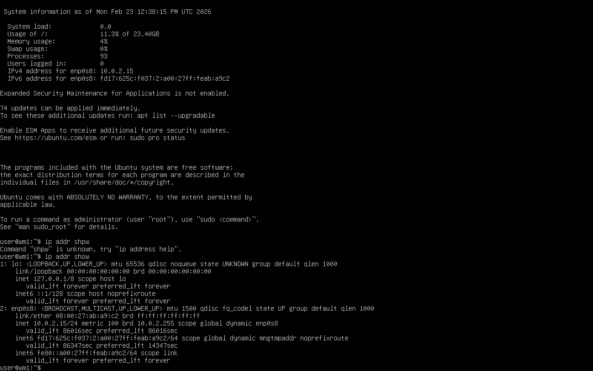
- Вывод команды ``ip addr show`` для просмотра существующих сетевых интерфейсов для ws2:
    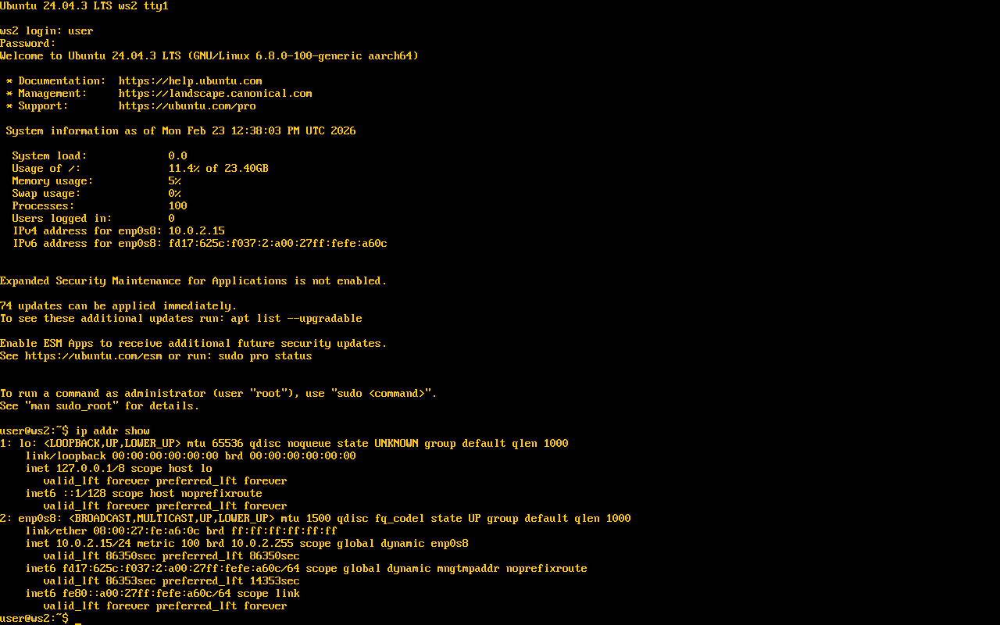

- Всего мы видим при выводе ``ip a`` 2 сетевых интерфеса и ни один из них не соответсвует нашей внутренней сети, из-за чего джелаем вывод, что внутрненнго сетевого интерфейса у нас нет, его нужно создать в настройках ws (добавил 2 адаптор с названием ``ws-a2``). После чего через ``ip a`` проверяем, какой именно интерфейс был добавлен (благодаря этому в настройках интерфеса мы сможем указать его название и задать ему спой IP)

- Послед чего в ``netplan`` через редактор создаем файл ``00i-installer-config.yaml`` в котором описываем внутрненний сетевой интерфейс с нужным для нас IP и маской 192.168.100.10/160

    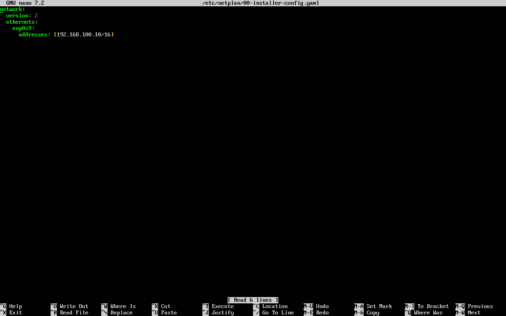

- Выдать для ws2 IP 172.24.116.8/12 по той же системе:

    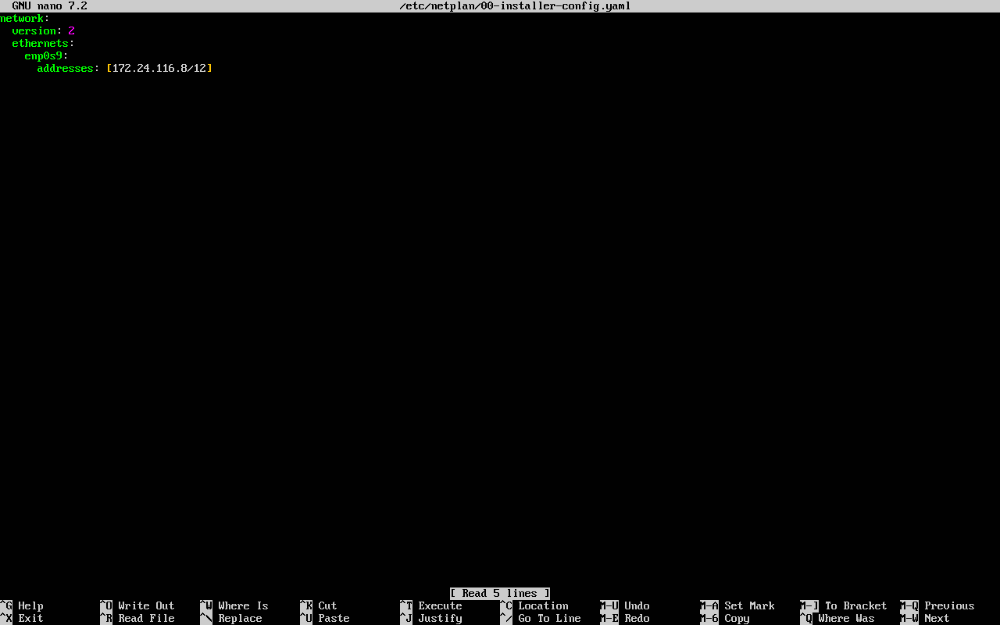

- Файлы в /etc/netplan/ по соображениям безопасности должны иметь строго определенные права (обычно 600 или 644). Используем ``sudo chmod 600 /etc/netplan/00-installer-config.yaml`` чтобы после выполнить команду ``sudo netplan apply``. Ниже представлен вывод команды для ws-1 & ws-2:

    

    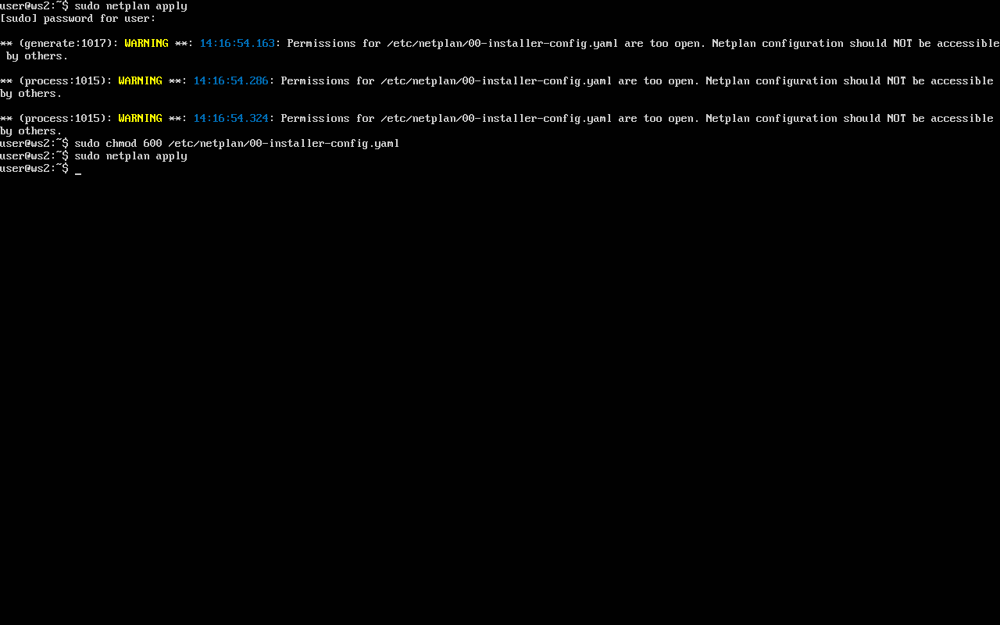

- Также в момент работы можно не обратить внимание на ошибку синтаксиса. Можно провреить с помощью ``sudo netplan generate``

### 2.1 Добавление статического маршрута вручную

- Чтобы добавить статический маршрут, мы должны иметь общую сеть у виртуальных машин или мост, который имеет обую сеть. У нас ws-1 & ws-2 имеют разные сети, однако они подключены к одной сети epn0s8 - сеть одинаковая, однако это NAT - его сеть автоматически выдает DHCP. По сути это разные виртуальные роутеры, поэтому они не увидят друг друга. Следовательно нам нужно создать ``Адаптор 3`` внутренняя сеть одинаковым названием, после чего назначим временные IP c одной сети:

1. После подключения нового адаптора получаем сеть epn0s10. Для машины 1 задаем конфиг с IP из одной сети ``sudo nano /etc/netplan/01-...-...yaml`` (10.0.0.1/24), на машине 2 машине делаем также (10.0.0.2/). Теперь у нас есть сеть для обмена, фото используемой команды для машин 1 и 2 ниже:

        sudo nano /etc/netplan/01-installer-config.yaml

   
   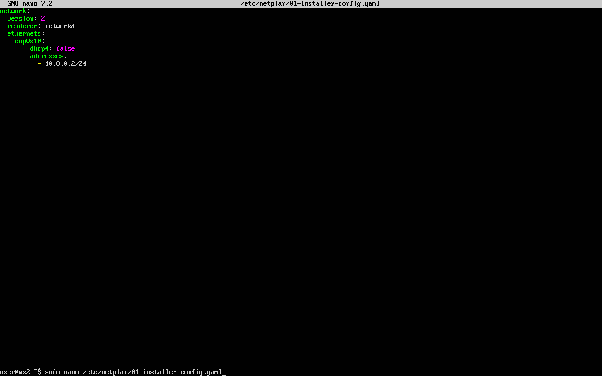

2. (Вначале включаем у 2 и 3 адаптора у 2х машин неразборчивый режим на "разрешить все"). 
На 1 машине прокладываем статичный маршрут к машине 2 от 1 (``ws-2 via enp0s10`` второй машины)

        sudo ip route add 172.16.0.0/12 via 10.0.0.2 dev enp0s10

    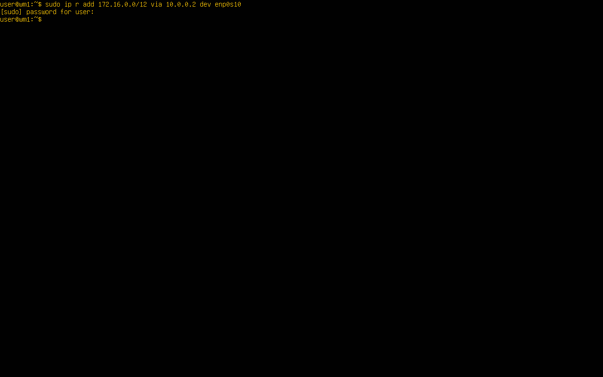

3. На 2 машине рокладываем статичный маршрут к машине 1 (``ws-1 via enp0s10``  первой машины) 

        sudo ip route add 192.168.0.0/16 via 10.0.0.1 dev enp0s10

    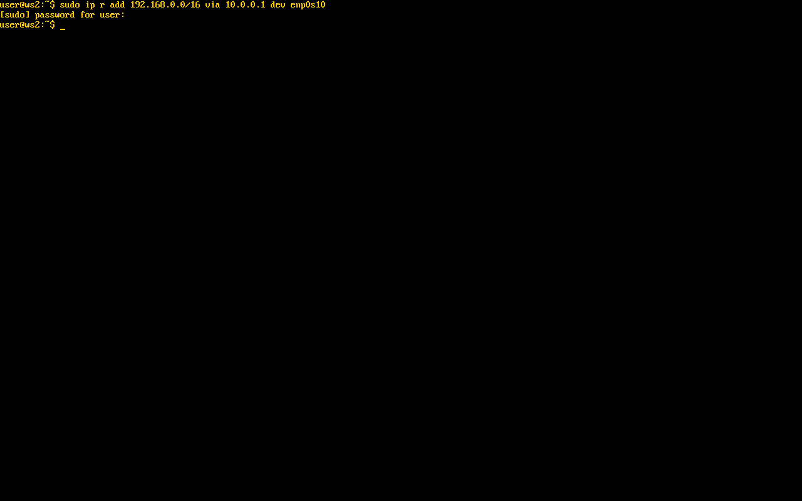

4. Важно: мы указываем не ip для пингования машины, а только адрес сети. поэтому в коде мы указываем не 100.10, а 0.0.

### 2.2. Добавление статического маршрута с сохранением

